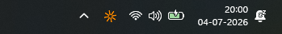
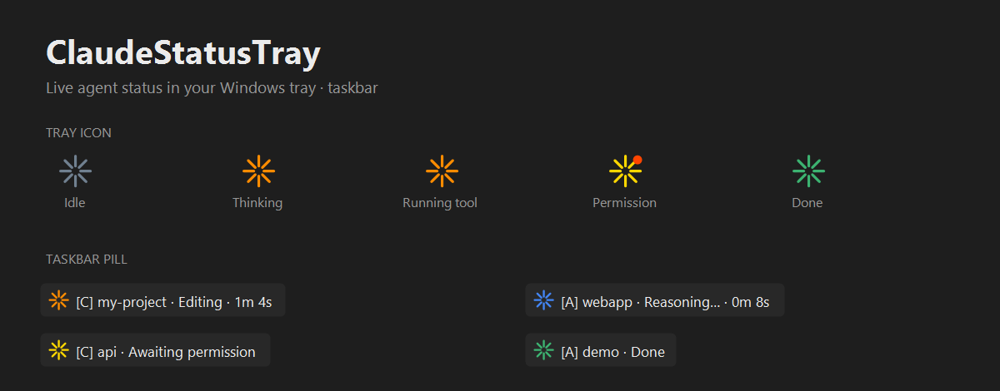

# claude-status-tray-windows

A lightweight Windows system-tray indicator for AI coding agents. It shows — at a glance, on your taskbar — what Claude Code (and Antigravity) is doing right now: thinking, running a tool, awaiting your permission, or done, plus the elapsed time of the current turn and desktop notifications for the moments that matter.






It's a Windows port of the macOS [m1ckc3s/claude-status-bar](https://github.com/m1ckc3s/claude-status-bar). The Swift menu-bar UI was rewritten from scratch as a native C#/.NET tray app; the reusable asset — the Claude Code hooks that publish per-session state — was ported to Windows.

## Features

- **Tray icon** — a Claude-style spark that spins while working. Color encodes state: gold (awaiting permission), orange/blue (working, tinted by provider), green (done), grey (idle).
- **Priority-aware** — with several sessions live, the icon reflects the most urgent: `permission > tool > thinking > idle`.
- **Taskbar status pill** — an always-visible label docked on the taskbar showing `[C] project · Editing · 1m 4s`, so you don't have to hover. Draggable; docks Left or Right.
- **Per-session menu** — right-click lists every active session across providers; click one to bring its window to the front (best-effort).
- **Desktop notifications** — distinct toast + sound per event: a warning + beep when a session needs your approval, an info + chime when a turn completes. Both on by default, individually toggleable.
- **Session-limit reset** — when you hit a usage limit, the pill and a notification surface when it resets (read from the transcript tail).
- **Multi-provider** — tracks Claude and Antigravity side by side, tagged `[C]` / `[A]`, colored by brand. (See [Antigravity status](#antigravity-status).)
- **Resident & cheap** — autostarts at login, polls only files whose timestamp changed, idle CPU negligible. No network except an optional manual update check. No telemetry.

## How it works

Two independent halves, coupled only by a set of small JSON files — the tray app never talks to the agent directly.

```
Claude Code hooks (Node.js)                    Tray app (C#/.NET WinForms)
  UserPromptSubmit / PreToolUse / ...   write    poll every 400ms, pick the
  -->  %USERPROFILE%\.claude\statusbar\  ----->   highest-priority live session,
       state.d\<session_id>.json                  render icon + pill + toasts
```

Each live session writes one state file (`state`, `label`, `project`, `pid`, `startedAt`, `ts`, …). `SessionEnd` deletes it. The tray app is a pure consumer: it reads every provider's `state.d`, drops dead/stale sessions, and renders. Adding a provider is just another directory to poll.

## Requirements

- Windows 11 (the taskbar auto-promotion and dock use Win11 shell details; earlier versions fall back gracefully).
- [Node.js](https://nodejs.org) — the hooks run under it (`node --version` to check).
*No .NET SDK is required to run the app; the repository includes a pre-compiled standalone binary.*

## Install

Clone the repository and run the installer script:

```powershell
git clone https://github.com/vyshnav-suresh/claude-status-tray-windows.git
cd claude-status-tray-windows
powershell -ExecutionPolicy Bypass -File .\install.ps1
```

> **Note on ExecutionPolicy**: `-ExecutionPolicy Bypass` is a standard, temporary flag used to get past PowerShell's default block on running downloaded scripts. It only applies to this single command and makes no permanent change to your system configuration.

The installer will copy the tracked executable directly into `%LOCALAPPDATA%\ClaudeStatusTray\`, configure the Node.js hooks inside your global `~/.claude/settings.json`, register the app to run on startup, and launch it.

### Uninstall

```powershell
.\uninstall.ps1
```

Strips the hooks (leaving your other hooks intact), stops the app, removes the startup entry, and deletes the local installation directory.

### For Developers (Building from Source)

If you wish to modify the C# code, you will need the [.NET 9 SDK](https://dotnet.microsoft.com/download) installed. Recompile the binary by running:

```powershell
.\build.ps1
```

This publishes a self-contained, single-file executable to `dist\ClaudeStatusTray.exe` which is then tracked by Git.

## Settings

Right-click the tray icon. Choices persist to `%USERPROFILE%\.claude\statusbar\settings.json`:

| Item | Default | Effect |
|---|---|---|
| Show status label | on | the floating taskbar pill |
| Show timer | on | elapsed `Xm Ys` while working |
| Notifications | on | desktop toasts per event |
| Sound | on | beep on permission, chime on completion |
| Icon color | Orange | `Orange` or `System` (adapts the idle dot to the taskbar theme) |
| Dock side | Right | pill on the Left or Right of the taskbar |
| Check for updates at startup | off | opt-in GitHub-releases check |

## Antigravity status

The **consumer side is done**: the tray displays any Antigravity session that writes `%USERPROFILE%\.antigravity\statusbar\state.d\*.json`, tagged `[A]` and colored blue.

The **publisher side is not built**. Antigravity is a VS Code fork with no Claude-Code-style hooks and no agent API to hook into; its agent state lives in an undocumented internal SQLite store, not viable to reverse-engineer. So nothing writes those files yet. Two things do work today: running **Claude Code inside Antigravity** (its extension is installed) is tracked via the normal hooks, and a clean extension-based publisher becomes possible if/when Antigravity exposes an agent API. See [antigravity_integration_plan.md](antigravity_integration_plan.md).

## Project layout

```
hooks/          Node.js hooks ported from upstream (write the state files)
app/            C#/.NET WinForms tray app (Program.cs)
build.ps1       publish the single-file exe
install.ps1     build + wire hooks + autostart + launch
uninstall.ps1   tear it all down
```

### 📄 Project Documents
- [Project Evaluation & Scorecard](project_evaluation.md) — Architectural analysis, scorecards, and design tradeoffs.
- [Antigravity Integration Plan](antigravity_integration_plan.md) — Future implementation plan to link the publisher-side of Antigravity.
- [Proposed Features & Roadmap](proposed_features.md) — Upcoming features backlog (toast notifications, custom chime wave profiles, process killer).

Run the app's self-checks with `dotnet run --project app -- --selftest`.

## Support

If this saves you from missing permission prompts, you can buy me a coffee ☕

**[buymeacoffee.com/vyshnavofck](https://buymeacoffee.com/vyshnavofck)**


## License

[MIT](LICENSE).

## Credits

Ported from [m1ckc3s/claude-status-bar](https://github.com/m1ckc3s/claude-status-bar). The hook scripts and state-file contract originate there; please refer to that project for the hooks' license.
