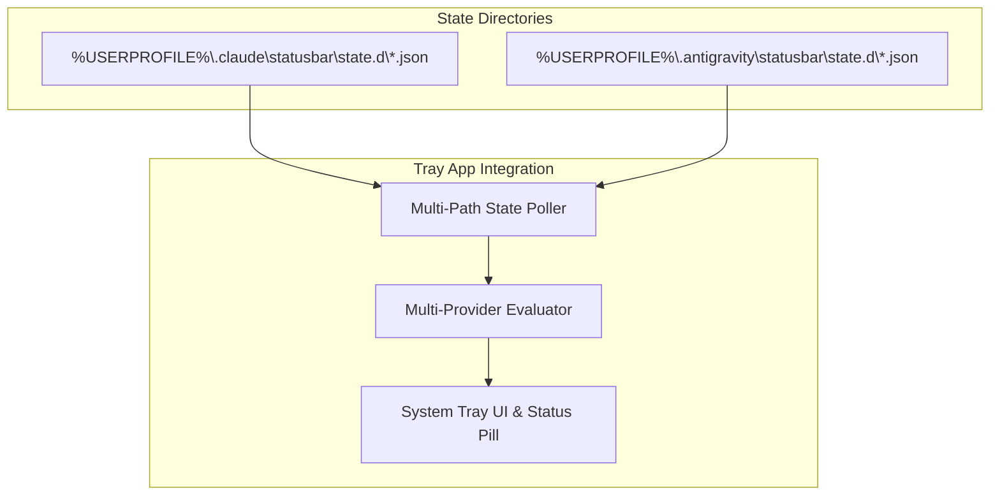

# Plan: Multi-Provider Support (Claude & Antigravity) for Windows Status Tray

This plan outlines the changes required to expand the status tray application from a Claude-only tool into a multi-provider status tray that supports tracking **Antigravity** (and future agentic assistants) side-by-side.

---

## 🎯 Goal
Extend the native Windows tray application and hooks to:
1. Poll status state files from both Claude (`.claude`) and Antigravity (`.antigravity`) directories.
2. Intelligently aggregate active sessions, resolve priorities across providers, and display clear origin tags (e.g., `[A]` vs `[C]`) in tooltips, list menus, and the floating status pill.
3. Establish a standard hook/event specification for the Antigravity execution environment.

---

## 🔧 Proposed Changes



### 1. Tray Application Updates (`app/Program.cs`)

#### 📂 Multi-Path State Polling
Modify [Program.cs](file:///c:/Users/Vyshnav%20Suresh/Documents/notification-ide-ai/app/Program.cs) to check multiple configuration paths.
- Update settings and directory paths to support a list of directories:
  ```csharp
  static readonly Dictionary<string, string> ProviderStateDirs = new()
  {
      { "Claude", Path.Combine(Environment.GetFolderPath(Environment.SpecialFolder.UserProfile), ".claude", "statusbar", "state.d") },
      { "Antigravity", Path.Combine(Environment.GetFolderPath(Environment.SpecialFolder.UserProfile), ".antigravity", "statusbar", "state.d") }
  };
  ```

#### 🏷️ Schema Extensions & Provider Tags
- Add a `Provider` field to the `Session` class to trace file origin:
  ```csharp
  sealed class Session
  {
      // ... existing properties ...
      public string Provider { get; set; } = "Claude"; // Populated during reading based on directory
  }
  ```
- Update label formatting to prefix the provider:
  ```csharp
  public static string RowLabel(Session s)
      => $"[{s.Provider[..1]}] {(string.IsNullOrEmpty(s.Project) ? "(unknown)" : s.Project)} — {What(s)}";
  ```
  *Result Example:* `[A] notification-ide-ai — Awaiting permission` vs. `[C] current-cloud — Thinking…`

#### 🎨 Provider-Specific Icon Colors
- Allow different color schemes based on the provider. For instance:
  - **Claude**: Orange spark icon
  - **Antigravity**: Blue/Teal spark icon (matching the Google Gemini/DeepMind aesthetic)
- If both are running, the tray icon priority rule (e.g., `permission > tool > thinking > idle`) remains the primary selector. If states are equal, we can default to showing the most recently active session's brand color.

---

### 2. Antigravity State Publisher (Hooks)

To support tracking, the environment running Antigravity needs to emit state JSONs.

#### 📝 Hook Contract Schema
Each Antigravity session will write files to `%USERPROFILE%\.antigravity\statusbar\state.d\<session_id>.json`:
```json
{
  "state": "thinking | tool | permission | idle | done",
  "label": "Reasoning... | Running shell | Awaiting approval",
  "tool": "run_command",
  "project": "notification-ide-ai",
  "sessionId": "ag-session-8b02be8f",
  "pid": 5824,
  "started": true,
  "startedAt": 1783178000,
  "ts": 1783178040
}
```

#### 🔗 Integration Options
- **IDE Extension Integration**: If Antigravity is launched via a VS Code/IDE extension, the extension's execution controller will write these files on start/stop/step-change events.
- **CLI/Python Wrapper Hooks**: If run via shell, a wrapper script intercepts inputs/outputs and writes the states.

---

## 🧪 Verification Plan

### Automated Self-Tests
Extend the `--selftest` suite in [Program.cs](file:///c:/Users/Vyshnav%20Suresh/Documents/notification-ide-ai/app/Program.cs#L672) to test:
1. **Multi-Directory Parsing**: Mocking session files in both `.claude` and `.antigravity` paths and asserting that all sessions are successfully aggregated.
2. **Cross-Provider Prioritization**: Testing that an `Awaiting permission` state in Antigravity overrides a `Thinking` state in Claude.
3. **Prefix Labels**: Asserting that row labels are properly prefixed with the first letter of their provider (e.g., `[A]` and `[C]`).

### Manual Verification
1. Create a dummy state file in `%USERPROFILE%\.antigravity\statusbar\state.d\test.json` with state set to `thinking`.
2. Verify that the Windows tray app displays the running Antigravity session and formats the tooltip/menu correctly.
