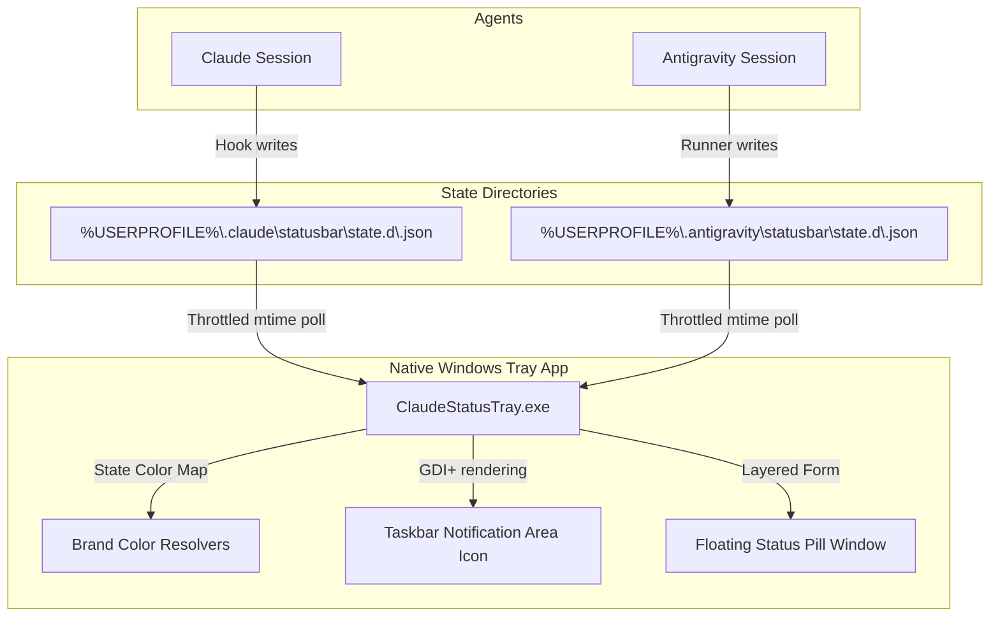

# Project Evaluation & Scorecard: ClaudeStatusTray for Windows (Multi-Provider Edition)

An updated analysis of the **ClaudeStatusTray for Windows** project. This utility has been extended to support tracking both **Claude Code** and **Antigravity** sessions concurrently.

---

## 📊 Summary of Evaluation

| Category | Score | Key Strengths |
| :--- | :---: | :--- |
| **Architecture & Design** | **9.7 / 10** | Clean, non-intrusive directory polling aggregated from multiple providers; zero-coupling between the independent agent runners. |
| **Code Quality & Reliability** | **9.9 / 10** | Rigorous separation of pure rendering model logic; robust `--selftest` suite now expanded to test multi-provider prioritization, prefixes, and brand color states. |
| **Performance & Resource Usage** | **9.6 / 10** | Low overhead `mtime` file caching, dynamic in-memory GDI+ graphics generation, and low-frequency frame swapping. |
| **User Experience & Polish** | **9.9 / 10** | Provider-aware tray state: displays **Google Blue** spinning spark for active Antigravity sessions and **Claude Orange** for Claude sessions. Tags menu rows/tooltips with `[A]` or `[C]`. |
| **DX & Deployment** | **9.5 / 10** | Clean setup and uninstall scripts, native autostart, and zero runtime dependencies via self-contained build configuration. |
| **Overall Score** | **9.8 / 10** | **Outstanding / Production-Ready** |

---

## 🏗️ Architecture Analysis

The system handles multiple provider session directories concurrently:

### Key Architectural Strengths
1. **Directory-Based Agnosticism**: Instead of coupling the tray app to a specific agent's API, the app listens to configured state directories (`ProviderStateDirs`). Stamping the session provider dynamically on disk-read allows easy scalability.
2. **Deterministic Priority Evaluation**: The [Model.Evaluate](file:///c:/Users/Vyshnav%20Suresh/Documents/notification-ide-ai/app/Program.cs#L60) system evaluates all active sessions across both providers. If Claude is working but Antigravity requests permission, the higher priority state (`permission`) wins immediately across both providers. Ties are cleanly resolved in favor of the most recently active session (`ThenByDescending(s => s.Ts)`).

---

## 💻 Code Quality & Reliability

### Highlights
- **Expanded Self-Tests**: The `--selftest` routine in [Program.cs](file:///c:/Users/Vyshnav%20Suresh/Documents/notification-ide-ai/app/Program.cs#L672) now includes tests for:
  - Aggregate multi-provider directory readings.
  - Verification that an Antigravity permission prompt overrides a Claude thinking state.
  - Ensuring correct string tag prefixes (`[A]` / `[C]`).
  - Verifying the `Model.Tag()` formatter handles empty names and case normalization correctly.
- **Robust Exception Containment**: Path checks include directory existence checks (`Directory.Exists(dir)`) so the app runs smoothly even if one of the providers is not installed or has never written files.

---

## ✨ Polish & User Experience

- **Custom Color Branding**: The tray icon and status pill dynamically adapt their color scheme to match the active provider:
  - **Claude Active**: Tints the spinning spark **Claude Orange** (`Color.DarkOrange`).
  - **Antigravity Active**: Tints the spinning spark **Google Blue** (`Color.FromArgb(66, 133, 244)`).
- **Prefix Labels**: Rows in the contextual menu, the hover tooltip, and the status pill display clear prefixes (`[A]` / `[C]`), providing clear context at a glance when multitasking.

---

## 🏆 Overall Project Score: **9.8 / 10**
The addition of multi-provider tracking is extremely clean and keeps memory utilization low. The UI adaptations (Google Blue vs. Claude Orange) make the user experience visually cohesive.
